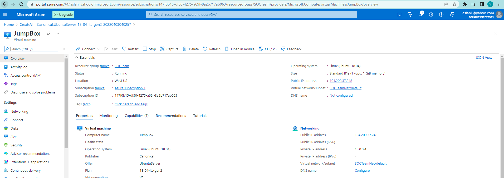
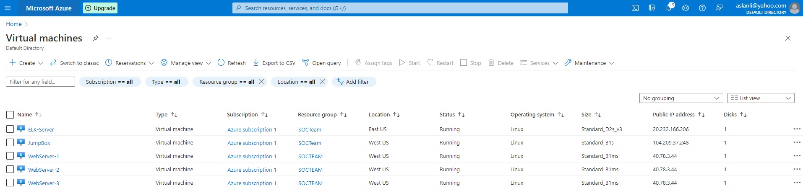
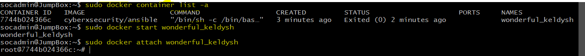
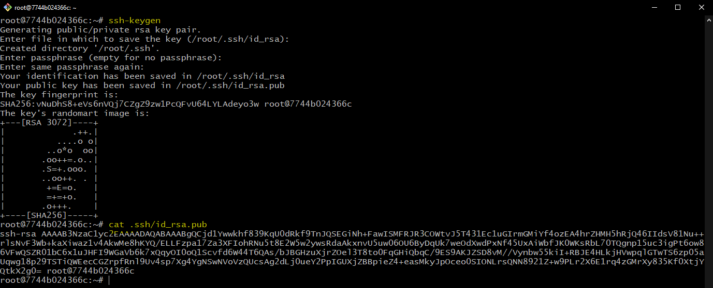
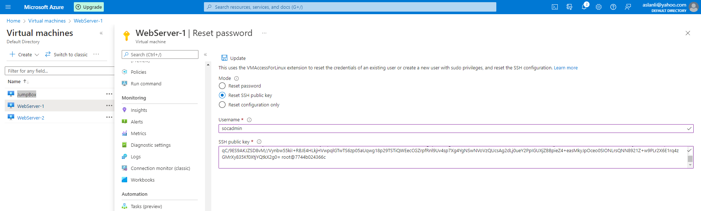
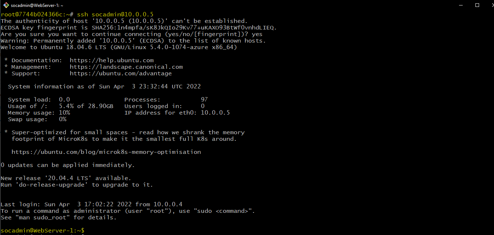
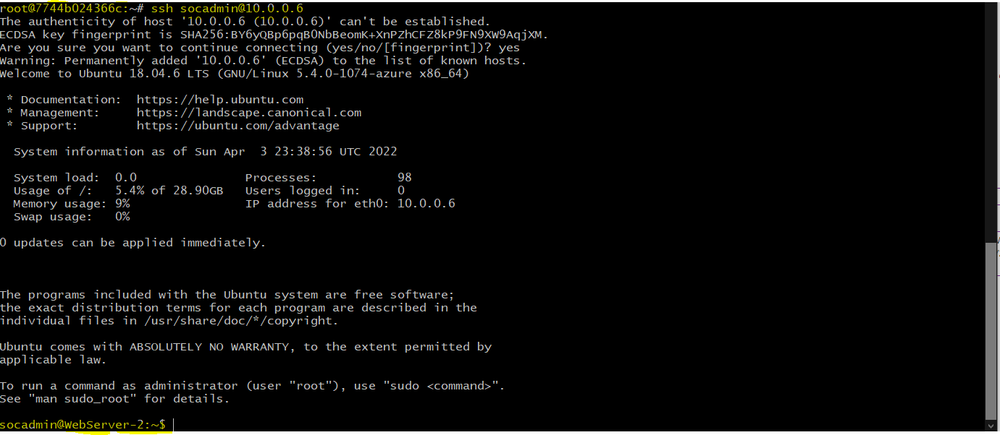
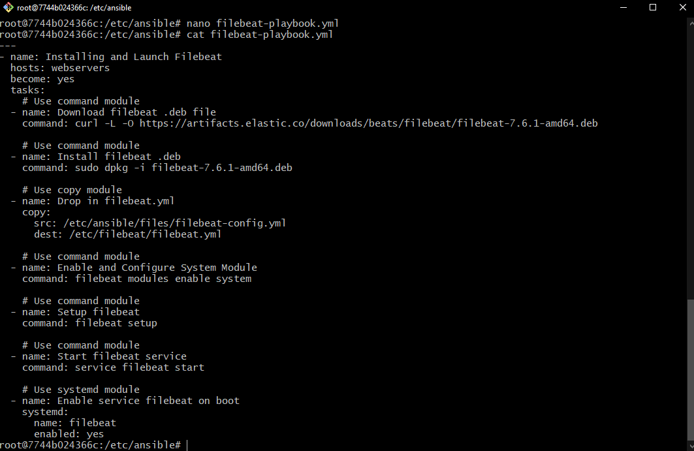
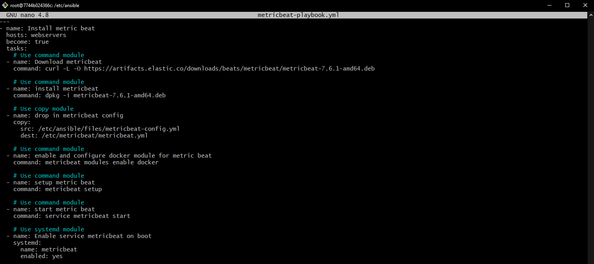
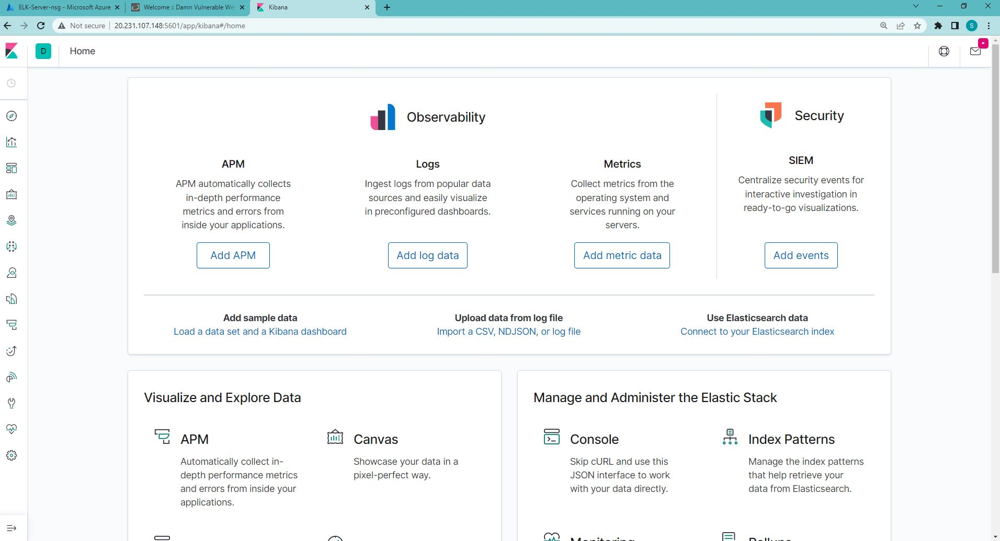

## Automated ELK Stack Deployment

The files in this repository were used to configure the network depicted below.

# 

These files have been tested and used to generate a live ELK deployment on Azure. They can be used to either recreate the entire deployment pictured above. Alternatively, select portions of the "ELK Azure Network" file(s) may be used to install only certain pieces of it, such as Filebeat.

=====================================================================================================================

Configuring Web Docker VM(s) with Ansible and Launch Web DVWA Docker Container:
# [installWeb.yml](/Playbook%20and%20Configuration/playbooks/installWeb.yml) 

Configure E.L.K. Stack Server Docker VM with Ansible and increase Virtual Memory to "262144"        
# [installELK.yml](/Playbook%20and%20Configuration/playbooks/installELK.yml)

Filebeat Configuration file with updated IP Addressesfor current use:
# [filebeat-config.yml](/Playbook%20and%20Configuration/configFile/filebeat-config.yml) 

Playbook to install and launch filebeat service:
# [filebeat-playbook.yml](/Playbook%20and%20Configuration/configFile/filebeat-playbook.yml)

Metricbeat Configuration file highlighted only the most common options:
# [metricbeat-config.yml](/Playbook%20and%20Configuration/configFile/metricbeat-config.yml)

Playbook to install metricbeat (Docker Metrics):
# [metricbeat-playbook.yml](/Playbook%20and%20Configuration/playbooks/metricbeat-playbook.yml) 

======================================================================================================================

This document contains the following details:

- Description of the Topology
- Access Policies
- ELK Configuration
  - Beats in Use
  - Machines Being Monitored
- How to Use the Ansible Build

### Description of the Topology

The main purpose of this network is to expose a load-balanced and monitored instance of the Damn Vulnerable Web App(DVWA)

- `Load Balancer` adds resiliency by rerouting live traffic from one server to another, if a server falls prey to a DDoS atack or becomes unavailable. It ensures that the application will be highly available, in addition to restricting unauthorized access to the network. A load balancer can add additional layers of security to your website without any changes to your application. It can reduce the load on your web servers and optimize traffic for a better user experience.

- A `Jump Box` prevents Azure VMs from being exposed by a public IP Address. You can monior and log all within the same system/box. You can restrict who can access and from which IP.

- Integrating an `ELK server` allows users to `easily monitor` the vulnerable VMs for changes to `the machine traffic/metrics and system logs`.
![ElkServer]

- `Filebeat` monitors the log files or locations that you specify, `collects log events`, and forwards them either to Elasticsearch or Logstash for indexing."

- `Metricbeat` is a lightweight shipper (or agent) which is used to collect system’s metrics and application metrics and send them to `Elastic Stack Server` (i.e Elasticsearch)"

# `The configuration` details of each machine may be found below.

| **_Name_**  | **_Function_** | **_IP Address_** |**_Operating System_**|**_Public IP Address_**|
|-------------|----------------|------------------|----------------------|-----------------------|
|   JumpBox   | Gateway        |    10.0.0.4      | Linux Ubuntu 18.04   |   104.209.37.248      |
|Load Balancer| Web Traffic    |      N/A         |       ----           |    40.78.3.44:80      |
| WebServer-1 | DVWA Container |    10.0.0.5      | Linux Ubuntu 18.04   |        N/A            |
| WebServer-2 | DVWA Container |    10.0.0.6      | Linux Ubuntu 18.04   |        N/A            |
| WebServer-3 | DVWA Container |    10.0.0.7      | Linux Ubuntu 18.04   |        N/A            |
| ELK-Server  | Monitoring     |    10.1.0.4      | Linux Ubuntu 18.04   |   20.232.166.206      |  

### Access Policies

- The machines on the internal network are `NOT` exposed to the `public Internet`. 

- Only the `JumpBox` machine can accept SSH connections from the Internet. Access to this machine is only allowed from
  the following IP address with an authenticated `ssh-key`:

- JumpBox has a Public IP address with a very strict access policy. 

- the `only IP address` allowed to `connect` to the jumpbox via SSH is: `[My Public IP]`

- `Web-Server` machines within the network can only be accessed by `JumpBox machine` with `ssh-key`authorization.

- `Web-Server` machines do `NOT` have a public IP address. The frontend of the web pages can only be reached via Load
   balancers Public IP address using `HTTP port 80`: `40.78.3.44:80`

- The `Private IP address` of the `JumpBox` machine is: `10.0.0.4`

- A summary of the `access policies` in place can be found in the table below.

|     **_Name_**     | **_Publicly Accessible_** |    **_Allowed IP Addresses_**   |
|--------------------|---------------------------|-------------------------------- |
|     JumpBox        |       NO                  |[My Public IP] via SSH port 22   |
|   WebServer-1      |       NO                  |     10.0.0.4  via SSH port 22   |
|   WebServer-2      |       NO                  |     10.0.0.4  via SSH port 22   |
|   WebServer-3      |       NO                  |     10.0.0.4  via SSH port 22   |
|    ELK-Server      |       NO                  |[My Public IP] via TCP port 5601 |

- 

### Elk Configuration

Ansible was used to automate configuration of the ELK machine. No configuration was performed manually, which is advantageous for the following reasons:

- Ansible lets you quickly deploy multi-tier applications by using a **YAML** playbook.
  `Time savings` translate to major reductions of costs before deployment and those associated with downtime.

- Ansible can figure out how to get your systems to the correct state you would like them to be.
- `Consistency and reliability` due to automated accuracy. 
   
- Putting `Infrastructure as Code (IaC)` to practice for more efficient operations.

- The `playbook` implements the following tasks:

  - The steps of the ELK installation play.
    - Install docker.io
    - Install pip3 
    - Install docker python module
    - Increase memory to a value `262144` 
    - Download and install ELK container
    - Enable Service docker on boot
   

- The following screenshot displays the result of running `docker ps` after successfully configuring the ELK instance. Docker gives unique names for the containers and we will use that name to start and attach to it. 
- My container name is `wonderful_keldysh`. 
- (Each time you use the docker run, you create a new container that makes confusion, if not on purpose)
  To get into the container, I need to start the container and then attach to it with following commands.

  

- Next, I have created `ssh keys` for using it to connect to the Webservers from the JumpBox. 
  Within the ansible prompt; I have typed `$ssh-keygen` command. Copied the `id_rsa.pub` key.
   

- Next, I have navigated to the `Azure console` and select `Virtual Machines => WebServer-1`. From the middle column
  scrolled down and selected Reset Password. Paste the `ssh key id_rsa.pub in the SSH public key box`. The Username is `socadmin`. Clicked Update. And did the same steps form WebServer-2 box.
     

- After successfully connecting you will notice that the prompt changed to socadmin@WebServer-1
- 

-  

### Target Machines & Beats
This ELK server is configured to monitor the following machines:

- Web-Server1 __10.0.0.5__
- Web-Server2 __10.0.0.6__
- Web-Server3 __10.0.0.7__

I have installed the following Beats on these machines:

- __Filebeat__
- __Metricbeat__

- 
- 

These Beats allows us to collect the following information from each machine:

- `Filebeat` is a lightweight shipper for forwarding and centralizing log data. Installed as an agent on your servers.
  - It consists of two main components: inputs and harvesters. These components work together to tail files and send 
  event data to the output that you specify.
  - It keeps the state of each file and frequently flushes the state to disk in the registry file. The state is used to remember the last offset a harvester was reading from and to ensure all log lines are sent. If the output, such as Elasticsearch or Logstash, is not reachable, `Filebeat` keeps track of the last lines sent and will continue reading the files as soon as the output becomes available again. 
  - While Filebeat is running, the state information is also kept in memory for each input.

- `Metricbeat` consists of modules and metricsets. A Metricbeat module defines the basic logic for collecting data 
  from a specific service. The module specifies details about the service, including how to connect, how often to collect metrics, and which metrics to collect.
- Collects `Metrics` from your system(s) and service(s) such as CPU, memory, disk usages, network usages, and     
  services such as Apache, MySQL, MongoDB, Nginx, Redis, Zookeeper, and so on.

### Using the Playbook
In order to use the playbook, you will need to have an Ansible control node already configured. Assuming you have such a control node provisioned: 

SSH into the control node and follow the steps below:

- 1. Copy the configuration file (`ansible.cfg` and `hosts`) to `JumpBox`s `/etc/ansible/` folder.
  

- 2. Update the default `hosts` file to include the IP addresses of the target 
     machines in the correct host's group 
  

- Run the playbook , and navigate to  
  `Kibana` web interface `https://20.232.166.206/app/kibana:5601` to check that the installation worked as expected.
  - 
  - 

### Install `Docker.io and Pull Ansible Container`

- Install `docker.io` onto the Jumpbox by running `sudo apt update` to update current databases, 
  then `sudo apt install docker.io`
- Check to see if Docker service is running with this command `sudo systemctl status docker`
- Once docker runs, pull the cyberxsecurity/ansible container with the command 
  `sudo docker pull cyberxsecurity/ansible`
- Swith to the root user with `sudo su` and then run 
  `docker run -ti cyberxsecurity/ansible:latest bash`to lauch the Ansible container and connect it. 

-  Run command will only be used `once` to start the container, and will not need to be run again. Running it again will generate another instance of a second docker container which is not needed. `docker rm [container_number]` can be used to remove unused containers.

### Start and Access Docker Container

- To list out the name of the available Docker container running, type the command;
    `sudo docker container list -a` 

- To start the container up, run 
    `sudo docker start wonderful_keldysh]`. `wonderful_keldysh` is the name of the container.

- Attach the container to access and use the container, type the command;
    `sudo docker attach wonderful_keldysh`

### Running Playbooks from Ansible Container on Jump-Box-Provisioner

- Running YAML playbooks referenced previously in the README will be executed with the following command: 
  `ansible-playbook [path and name of playbook]` as referenced by the examples:

`ansible-playbook /etc/ansible/installWeb.yml` 
  
  
`ansible-playbook /etc/ansible/installElk.yml`
  

`ansible-playbook /etc/ansible/filebeat-config.yml`
  
  

`ansible-playbook /etc/ansible/metricbeat-config.yml`
  

## List of the commands that are used during the installation and configuration of the Automated ELKStack Project.

| Command                                   | Definition and Purpose                  |
|-------------------------------------------|-----------------------------------------|
| `ssh-keygen`                              | create ssh key to access and setup VM   |
| `sudo -l`                                 | check for sudo privledges               |
| `cat ~/.ssh/id_rsa.pub`                   | view the public ssh key                 |
| `ssh sysadmin@[Jump-Box IP]`              | log in to the Jump-Box                  |
| `sudo docker container list -a`           | list docker containers available        |
| `sudo docker start [container name]`      | start docker container                  |
| `sudo docker ps -a`                       | list all active and inactive containers |
| `sudo docker attatch [container name]`    | attaching and starting up container     |
| `cd /etc/ansible`                         | change to /etc/ansible directory        |
| `ls -la`                                  | list all files includes hidden          |
| `nano /etc/ansible/hosts`                 | edit hosts file                         |
| `nano /etc/ansible/ansible.cfg`           | edit ansible.confg file                 |
| `nano /etc/ansible/pentest.yml`           | edit pentest.yml file (setup)           | 
| `ansible-playbook [location][filename]`   | execute the specified playbook          |
| `ssh sysadmin@10.0.0.5` from `ansible`    | log into WebServer1 VM from ansible     |
| `ssh sysadmin@10.0.0.6` from `ansible`    | log into WebServer2 VM from ansible     |
| `ssh sysadmin@10.0.0.7` from `ansible`    | log into WebServer3 from ansible        |
| `ssh sysadmin@10.1.0.4` from `ansible`    | log into ELK VM from ansible            |
| `exit`                                    | terminate current shell                 |
| `sudo apt update`                         | check for any updates in terminal       |
| `sudo apt upgrade`                        | install any updates                     |
| `sudo apt install docker.io`              | install docker.io                       |
| `sudo service docker start`               | start docker                            |
| `sudo systemctl status docker`            | check status of docker                  |
| `sudo systemctl start docker`             | start docker                            |
| `sudo docker pull cyberxsecurity/ansible` | pull docker container                   |
| `sudo docker run -ti [contianer name]`    | run and create docker container         |
| `ansible -m ping all`                     | check connection of ansible containers  |
| `curl -L -O [path of file]`               | download file via curl                  |
| `dpkg -i [file name]`                     | install file and metricbeat             |
| `nano filebeat-config.yml`                | edit filebeat config                    |
| `nano filebeat-playbook.yml`              | edit filebeat playbook                  |
| `nano metricbeat-config.yml`              | edit metricbeat config                  |
| `nano metricbeat-playbook.yml`            | edit metricbeat playbook                |
| `http://[Elk-Server-IP]:5601/app/kibana`  | Navigating to Kibana dashboard          |    
| `nano [file name]`                        | edit and search inside a file           |

# All the sreenshots during Automated ELK Stack Deployment can be seen from the `fullProject` folder.

